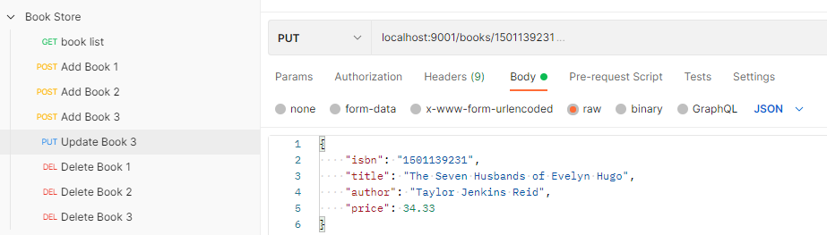

# Catalog Service

## REST API

| Endpoint	      | Method   | Req. body  | Status | Resp. body     | Description    		   	     |
|:---------------:|:--------:|:----------:|:------:|:--------------:|:-------------------------------|
| `/books`        | `GET`    |            | 200    | Book[]         | Get all the books in the catalog. |
| `/books`        | `POST`   | Book       | 201    | Book           | Add a new book to the catalog. |
|                 |          |            | 422    |                | A book with the same ISBN already exists. |
| `/books/{isbn}` | `GET`    |            | 200    | Book           | Get the book with the given ISBN. |
|                 |          |            | 404    |                | No book with the given ISBN exists. |
| `/books/{isbn}` | `PUT`    | Book       | 200    | Book           | Update the book with the given ISBN. |
|                 |          |            | 201    | Book           | Create a book with the given ISBN. |
| `/books/{isbn}` | `DELETE` |            | 204    |                | Delete the book with the given ISBN. |
|                 |          |            | 404    |                | No book with the given ISBN exists. |

## Useful Commands

| Gradle Command	         | Description                                   |
|:---------------------------|:----------------------------------------------|
| `./gradlew bootRun`        | Run the application.                          |
| `./gradlew build`          | Build the application.                        |
| `./gradlew test`           | Run tests.                                    |
| `./gradlew bootJar`        | Package the application as a JAR.             |
| `./gradlew bootBuildImage` | Package the application as a container image. |

After building the application, you can also run it from the Java CLI:

```bash
java -jar build/libs/catalog-service-0.0.1-SNAPSHOT.jar
```
## Testing Rest APIs
| APIs      | Description |  Request Body |  Response Body |
| ---- | --- |  --- |  --- |
| GET     http://localhost:9001/books  | Get all Books  | None | Array of Books
| POST    http://localhost:9001/books  | Add a new Book  | Book | Book
| PUT     http://localhost:9001/books/{isbn}  | Update a Book  | Book | None
| DELETE  http://localhost:9001/books/{isbn}  | Delete a Book  | None | None

### Get Book List




